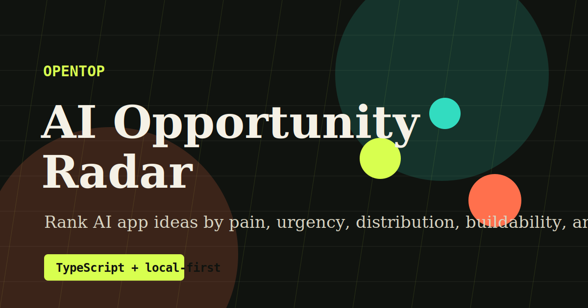

# OpenTop

[](https://github.com/dhb118/opentop/actions/workflows/ci.yml)
[](https://github.com/dhb118/opentop/actions/workflows/pages.yml)
[](LICENSE)



OpenTop is an AI opportunity radar for builders who want to choose, shape, and launch open-source AI apps. It turns a messy market signal into ranked product ideas, scoring, a first-release scope, and a launch plan.

The app is TypeScript-first, runs locally without an API key, and can optionally call OpenAI-compatible chat completion APIs or Ollama.

Live demo target: `https://dhb118.github.io/opentop/`

Example outputs: [Opportunity Gallery](docs/GALLERY.md)

Launch assets: [GitHub Publish Guide](docs/GITHUB_PUBLISH.md), [Starter Issues](docs/STARTER_ISSUES.md), [Launch Playbook](docs/LAUNCH_PLAYBOOK.md)

## Why It Can Earn Stars

Open-source AI projects usually spread when they do three things well:

- Give developers an immediately useful workflow.
- Work without signup or infrastructure.
- Produce artifacts people can show, fork, and extend.

OpenTop is built around those loops: paste a trend signal, get ranked app ideas, copy a GitHub-ready brief, then publish the idea or extend the scorer.

## Features

- Local demo engine for no-key analysis.
- OpenAI-compatible endpoint support.
- Ollama-compatible endpoint support through `/v1/chat/completions`.
- Editable opportunity assumptions: pain, urgency, and distribution.
- Score matrix for pain, urgency, distribution, buildability, and star potential.
- Copyable Markdown brief for GitHub issues, README sections, and launch drafts.
- Export actions for README briefs, Show HN posts, and JSON opportunity records.
- Downloadable SVG share cards for selected opportunities.
- Shareable brief links that preserve the full input signal in the URL.
- One-click sample briefs for local models, agents, prompt regression, and README positioning.
- In-app opportunity gallery with scored examples and share links.
- Responsive single-page interface built with Vite and TypeScript.

## Quick Start

```bash
pnpm install
pnpm dev
```

Build for production:

```bash
pnpm build
```

Run the local quality gate:

```bash
pnpm generate:gallery
pnpm test
pnpm build
```

## Model Setup

OpenTop works in demo mode by default. To use a model, open **Model Settings** in the app.

For OpenAI-compatible APIs:

- Provider: `OpenAI-compatible`
- Endpoint: `https://api.openai.com/v1/chat/completions`
- Model: `gpt-4.1-mini` or another chat-completions model

For Ollama:

- Run `ollama serve`.
- Pull a model, for example `ollama pull llama3.1`.
- Provider: `Ollama`
- Endpoint: `http://localhost:11434/v1/chat/completions`
- Model: `llama3.1`

## Roadmap

- Add screenshot capture and shareable opportunity cards.
- Import trend signals from Markdown, CSV, GitHub issues, and browser bookmarks.
- Export full repository scaffolds for selected ideas.
- Add a scoring template marketplace.
- Add benchmark examples for successful AI repos.

## Star Growth Plan

1. Publish a polished hosted demo and a 90-second screen recording.
2. Add five high-quality sample briefs based on recognizable AI developer pains.
3. Open starter issues for new scorers, export formats, and providers.
4. Submit to Hacker News, Product Hunt, Reddit, and AI engineering newsletters.
5. Write a transparent build log: "How I pick AI app ideas before writing code."
6. Keep a public gallery of generated ideas so stars compound through examples.

## License

MIT
