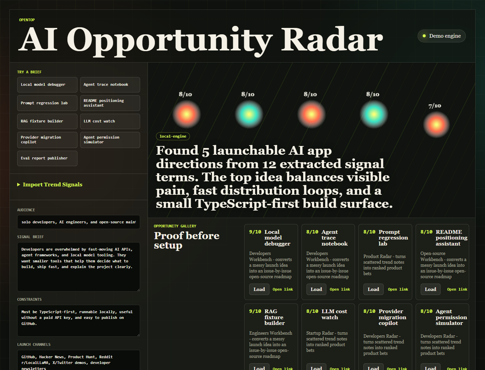

# OpenTop

[English](README.md) | [简体中文](README.zh-CN.md)

[](https://github.com/dhb118/opentop/actions/workflows/ci.yml)
[](https://github.com/dhb118/opentop/actions/workflows/pages.yml)
[](LICENSE)



OpenTop 是一个本地优先的 AI 应用选题和发布工具。

你可以把趋势笔记、GitHub issue、链接列表或一段产品想法粘贴进去。OpenTop 会生成可排序的开源 AI 应用方向，并给出评分依据、首版范围、README 文案、发布草稿和仓库脚手架。

默认不需要 API Key；需要更强生成能力时，也可以连接 OpenAI 兼容接口、Anthropic、Bedrock、Vertex AI 或 Ollama。

在线演示暂不可用：GitHub Pages custom domain 仍在修复中。请先用下方命令在本地运行。

示例输出：[机会图库](docs/GALLERY.md) | [AI 仓库基准](docs/BENCHMARKS.md)

发布资料：[GitHub 发布指南](docs/GITHUB_PUBLISH.md) | [新手任务](docs/STARTER_ISSUES.md) | [发布手册](docs/LAUNCH_PLAYBOOK.md)

## 适合谁

- 想做开源 AI 工具，但还没有确定切入点的开发者。
- 需要把零散趋势、用户反馈或 issue 变成产品方向的维护者。
- 想让 README、demo、issue 和发布文案更容易获得 GitHub stars 的团队。

## 核心能力

- 从 CSV、Markdown、笔记、书签、链接列表和公开 GitHub issue 导入研究信号。
- 本地生成 AI 应用方向，并按痛点、紧迫性、分发、可构建性和 Star 潜力评分。
- 使用评分模板切换不同策略，例如本地优先工具、Provider SDK、Agent 调试和发布生成器。
- 输出 README 简报、Launch Kit、贡献者 issue 队列、GitHub issue、Show HN、X 线程、Reddit 帖子和 JSON 记录。
- 下载 PNG/SVG 分享卡片和可运行的 TypeScript starter repo ZIP。
- 拉取公开 GitHub README，审计首屏钩子、截图、快速开始、demo、示例、贡献入口、信任信号和仓库主页元数据。
- 对比公开 AI 仓库的成功模式，辅助判断一个想法是否值得继续做。
- 支持演示模式、OpenAI 兼容接口、Anthropic、Bedrock、Vertex AI 和 Ollama。

## 快速开始

```bash
pnpm install
pnpm dev
```

生产构建：

```bash
pnpm build
```

本地质量检查：

```bash
pnpm generate:gallery
pnpm generate:benchmarks
pnpm sync:labels
pnpm test
pnpm build
pnpm check:publish
```

GitHub Pages 恢复后再运行：

```bash
pnpm smoke:pages
```

## 模型配置

OpenTop 默认使用本地演示模式。要接入模型，在应用里打开 **Model Settings**。

| Provider | 默认 endpoint | 默认模型 |
| --- | --- | --- |
| OpenAI-compatible | `https://api.openai.com/v1/chat/completions` | `gpt-4.1-mini` |
| Anthropic | `https://api.anthropic.com/v1/messages` | `claude-sonnet-4-5` |
| Anthropic on Bedrock | `https://bedrock-mantle.us-east-1.api.aws/anthropic/v1/messages` | `anthropic.claude-haiku-4-5` |
| Anthropic on Vertex AI | `https://global-aiplatform.googleapis.com/v1/projects/PROJECT_ID/locations/global/publishers/anthropic/models/MODEL:rawPredict` | `claude-haiku-4-5@20251001` |
| Ollama | `http://localhost:11434/v1/chat/completions` | `llama3.1` |

API Key 只保存在浏览器本地设置里，不会提交到仓库。使用 Vertex AI 时请先替换 `PROJECT_ID`；使用 Ollama 时先运行 `ollama serve` 并拉取模型，例如 `ollama pull llama3.1`。

## Star 增长计划

1. 恢复可访问的在线 demo，并录制 90 秒演示视频。
2. 补充来自真实 AI 开发痛点的高质量示例简报。
3. 持续开放适合新贡献者的 issue：评分器、导出格式、Provider、示例和文档。
4. 用 Launch Kit 准备 Hacker News、Product Hunt、Reddit 和开发者 newsletter 发布素材。
5. 写公开构建日志，说明如何在写代码前判断一个 AI 应用想法是否值得做。
6. 持续维护机会图库和 README 审计能力，让示例和工具本身一起带来 stars。

## README 语言

- [English](README.md)：GitHub 默认入口。
- [简体中文](README.zh-CN.md)：同步核心介绍、安装、模型配置和增长计划。

面向用户的功能或设置说明变更时，请同步更新两份 README。

## 许可证

MIT
